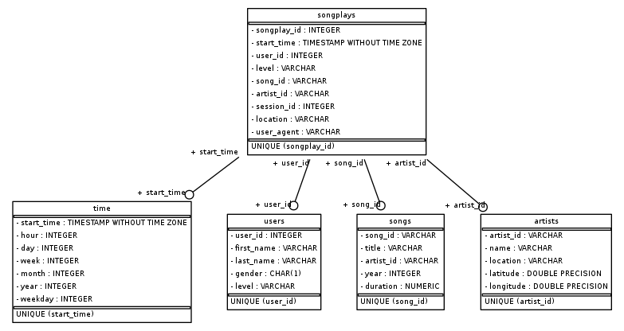

# Project: Data Modeling with Postgres

## Description

As a data engineer I am doing an assignment for the startup Sparkify. Indeed, Sparkify wants to have a precise idea about its music data in order to propose in the future a better music streaming application. To carry out this project I had to create a Postgres database with tables designed to optimize the queries on the analysis of the playback of songs and an ETL pipeline. The data is in json files.

## How to run 

1) You have to start a new terminal session and write : python create_tables.py
This will allow you to create the sparkifydb database needed for running other parts of the project.

2) Now in the terminal session write : python etl.py
This is nececessary for inserting/process the entire datasets into each table.

3) Run test.ipynb
For checking the database 

## An explanation of the files in the repository

*In the "data" repository :* 
- "song_data" is a subset of real data from the Million Song Dataset. Each file is in JSON format and contains metadata about a song and the artist of that song.
- "log_data" contains activity logs from a music streaming app based on specified configurations.

*create_table.py :* contains functions which drops and creates the tables.

*etl.ipynb :* reads and processes **a single file** from song_data and log_data and loads the data into the tables.
 
*etl.py :* reads and processes files from song_data and log_data and loads them into the tables.

*sql_queries.py :* contains all the sql queries (drop tables, create tables, and create queries).

*test.ipynb :* displays the first few rows of each table to let you check the database.

## Justification of my database schema

I created a star schema optimized for queries on song play analysis. In fact, primarily read optimized, star schemas will deliver good performance over large data sets.

   
    

THE FACT TABLE: The Fact Table is called 'songplays' and contains the columns songplay_id, start_time, user_id, level, song_id, artist_id, session_id, and location. The songplay_id is the primary key for this table. This means each row in this column is unique. 

USERS TABLE: The "users" table is a table which contains the users of the app. The "user_id" column is the primary key column, where the rows are all unique. The columns include user_id, first_name, last_name, gender, and level. This table can be joined to the songplays table by using the 'user_id' column in each table.

SONGS TABLE: The "songs" table contains all the songs in the database. The columns includes song_id, title, artist_id, year, and duration. The "song_id" column is the primary key column for this table. This table can be joined with songplays on 'song_id'.

ARTISTS TABLE: The "artists" table contains the artist names in the database. The columns include artist_id, name, location, latitude and longitude. The "artist_id" is the primary key for this table. This table can be joined to the songplays table on artist_id, and also the songs table.

TIME TABLE: The "time" table has the timestamp data for the song plays broken down into smaller units of time. The columns include start_time, hour, day, week, month, year, and weekday. The start_time column is the primary key. The time table can be joined to the songplays table using start_time.

